# Couple Finance

**The shared wallet for two people whose incomes aren't equal.**

Roommates split 50/50. Couples don't live 50/50. When one partner earns ₹90k and the other ₹60k,
splitting rent down the middle quietly makes the lower earner carry more. Couple Finance fixes that in
one decision: **set your income ratio once, and every expense splits by it — automatically, forever.**
No spreadsheets, no "I'll pay you back," no mental math. Just add what you spent; the app always knows
who owes whom, and settles it over UPI in one tap.

Shared password, no per-user accounts. Built as a real, deployed product — FastAPI backend, zero-framework
front end, money stored to the paise, UPI settlement, receipt OCR, and a hosted database, running live and free.

---

## See it move

**A 60-second walk through the whole app** — add an expense, pick a brand, then activity, settle-up, trends and notes.

<p align="center"></p>

**Whose turn to pay? One tap.** The payer slides between the two of you — teal for one, coral for the
other — and the whole ledger re-reasons instantly.

<p align="center">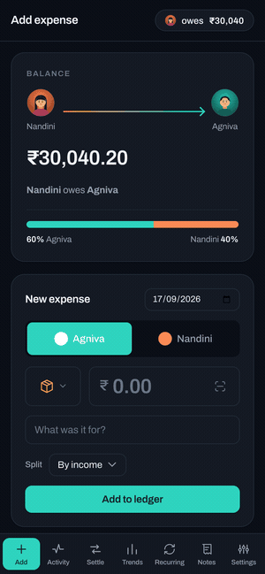</p>

---

## What it does

- **Income-ratio split** — set both incomes once; every expense splits automatically.
- **Who paid → who owes** — a running, directional settle-up balance, always on top.
- **One-tap UPI settle** — deep-link + QR pay the exact amount to the right person; full or partial.
- **Brand-aware categories** — 21 categories, 14 of them the apps you actually use (Amazon, Swiggy,
  Zomato, Zepto, Blinkit, Instamart, Flipkart, Rapido, Uber, UrbanClap…), each with its own color + icon.
- **Receipt OCR** — snap a bill; it reads the total and merchant and fills the form.
- **Per-expense override** — send one expense 50/50 or fully custom without touching the global ratio.
- **Recurring** — rent/wifi/etc. auto-posted each month to the right payer.
- **Trends** — monthly spend by person, per-person totals, per-category breakdown.
- **Shared notes & checklists**, **profile photos**, dark mode, and **CSV export**.

---

## The screens
*Dark mode, seeded with two months of sample data.*

### 00 · The "aha" — set the ratio once
Type both incomes and the split comes alive (60 / 40 here). Fairness by income, decided once.
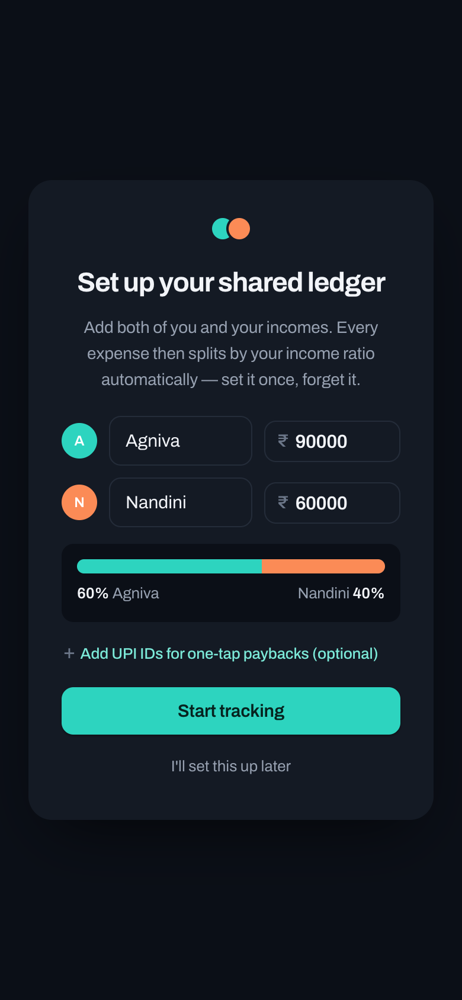

### 01 · Home — always know who owes whom
Every screen opens on a directional balance: two faces, an arrow, a number. Adding an expense takes seconds.
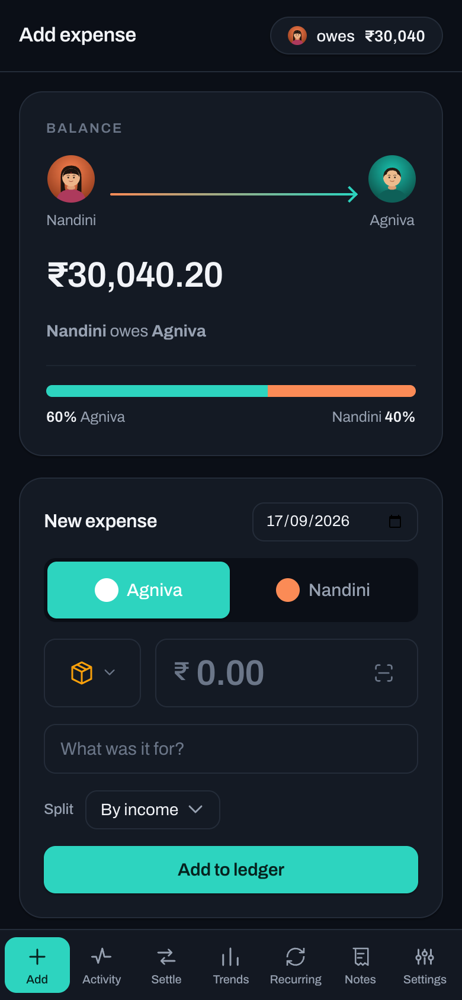

### 02 · One tap to switch payer
Tap the other person — the pill slides, the color flips. No dropdowns, no "who paid?" friction.
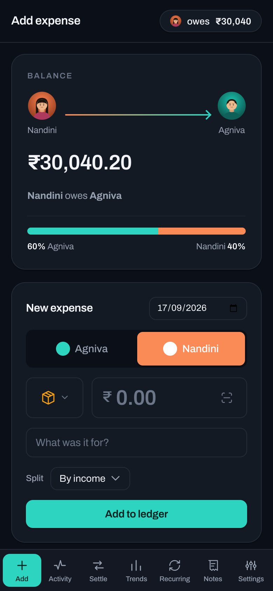

### 03 · Where they actually spend
The category picker speaks the language of modern Indian spending — 21 categories, 14 of them the apps you
open every day, each with its own color and icon.
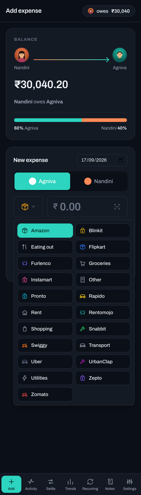

### 04 · Fair by default, flexible when you need it
Splits default to the income ratio, but any single expense can go 50/50 or fully custom.
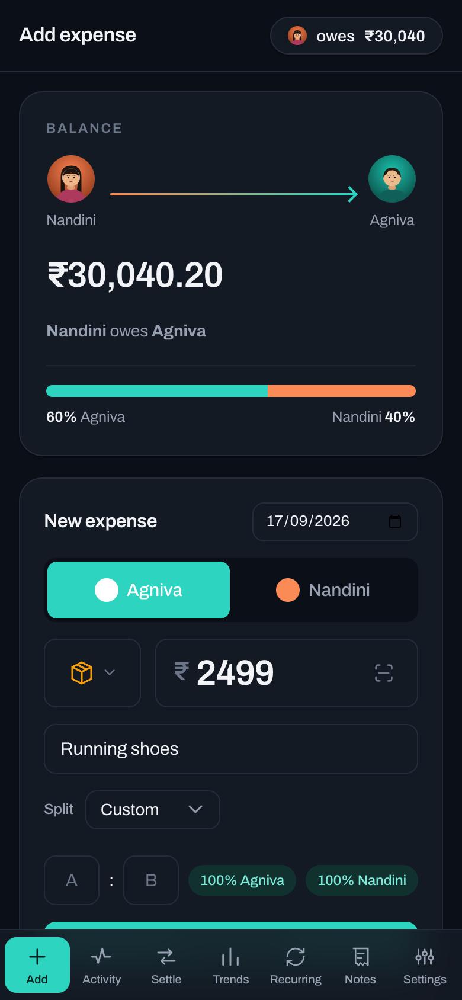

### 05 · Snap the receipt, skip the typing
Point the camera at a bill; OCR reads the total and merchant and fills the form.
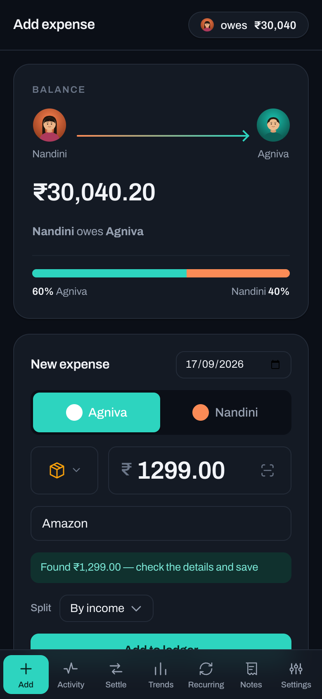

### 06 · The feed that sells itself
Two months of real life — each row a face, a brand, a date, the amount, and exactly how it split.
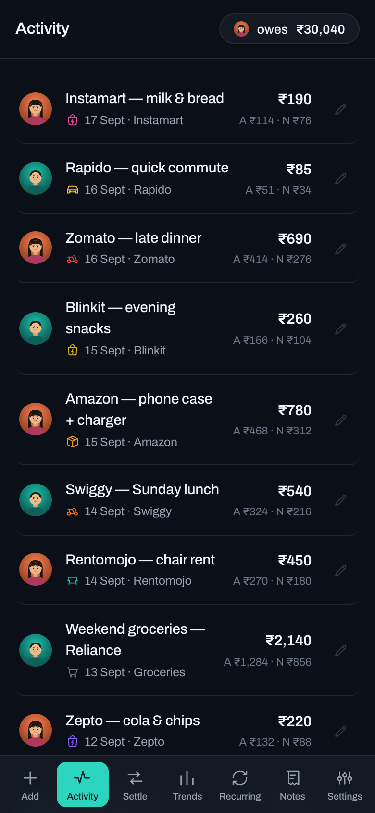

### 07 · Settle in one tap over UPI
A UPI deep-link and a QR pay the exact amount to the right person. The balance updates the moment it's paid.
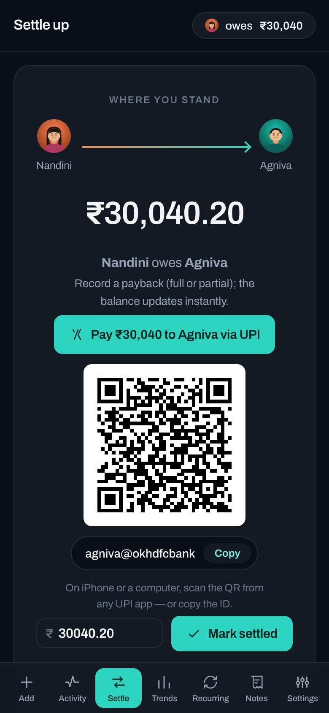

### 08 · Trends — where the money goes
Monthly spend split by person, per-person totals, and a full category breakdown.
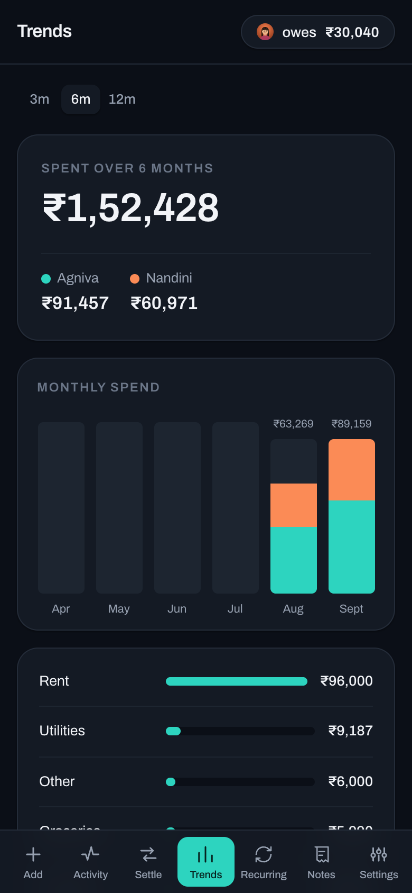

**Spend history** — tap any of your most-used categories to chart its spend over time, like a
price-history graph: the range it moved through and where this month lands, each category in its own color.
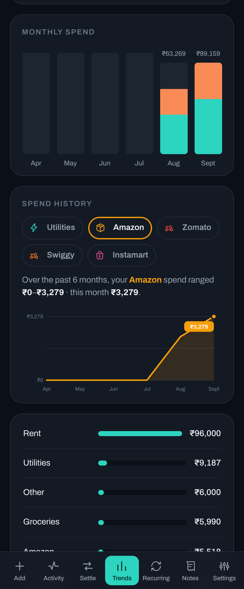

### 09 · Recurring — rent and bills post themselves
Set rent and broadband once; they auto-post every month on the right day, to the right payer.
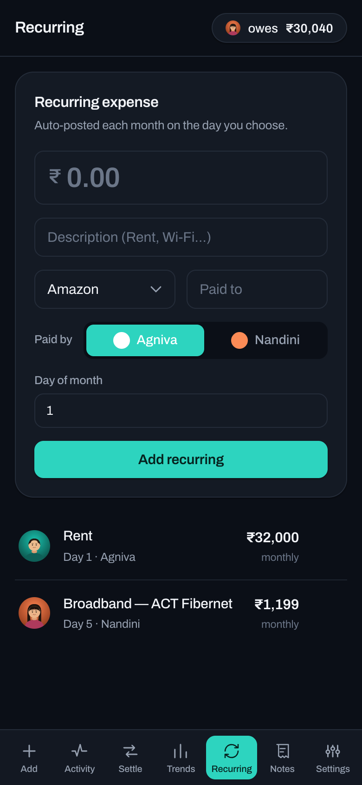

### 10 · Shared notes & checklists
Trip budgets, shopping lists, reminders — pinned, searchable, with tappable checklists.


### 11 · Make it yours
Names, incomes (the ratio), UPI IDs with live validation, profile photos, categories, theme, and CSV export.
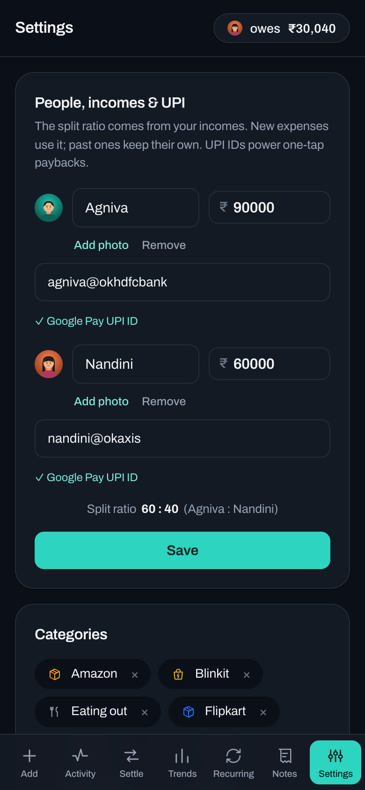

### 12 · Same app, bigger screen
Fully responsive — the phone experience scales to a clean desktop workspace.
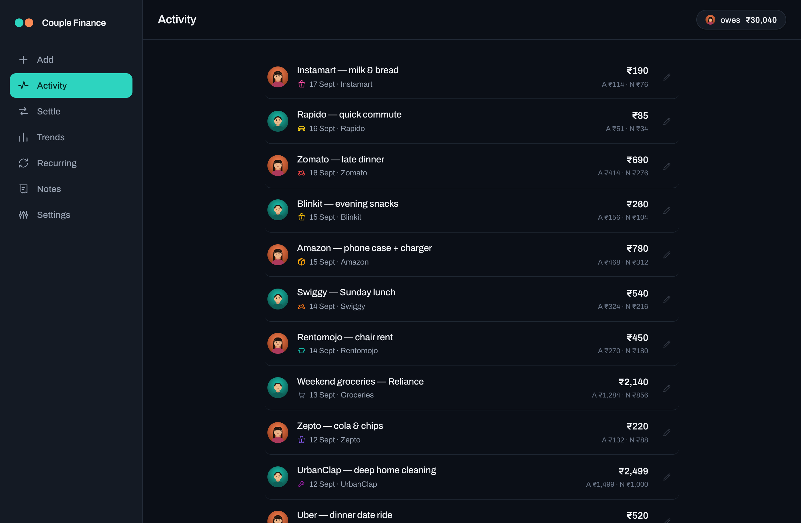

---

## Run locally
```bash
pip install -r requirements.txt
export APP_PASSWORD=yourpassword
export SECRET_KEY=$(openssl rand -hex 32)
uvicorn app:app --reload
# open http://localhost:8000
python test_money.py    # money-math checks
```

## Deploy — Render + Turso (card-free, persistent)

The app uses plain `sqlite3` locally and **Turso** (hosted libSQL) automatically when
`TURSO_DATABASE_URL` + `TURSO_AUTH_TOKEN` are set. No code change needed to switch.

1. **Turso DB** (one-time):
   ```bash
   turso db create couple-finance
   turso db show --url couple-finance        # -> TURSO_DATABASE_URL (libsql://...)
   turso db tokens create couple-finance     # -> TURSO_AUTH_TOKEN
   ```
   

2. **Render**: New + → **Blueprint** → pick this repo (`render.yaml` is detected).
   Then set the env vars: `APP_PASSWORD` (shared password), `TURSO_DATABASE_URL`,
   `TURSO_AUTH_TOKEN`. `SECRET_KEY` is auto-generated.
   

3. Deploy. Render's free instance sleeps when idle and wakes on the next visit;
   your data lives in Turso, so nothing is lost across sleeps or redeploys.

### Fly.io alternative (plain SQLite on a volume — needs a card)
See `fly.toml`: `fly launch --no-deploy`, `fly volumes create data --size 1`,
`fly secrets set APP_PASSWORD=... SECRET_KEY=$(openssl rand -hex 32)`, `fly deploy`.
On Fly, leave the Turso vars unset — it uses the local SQLite file on the volume.

## Notes
- All money is stored as integer **paise** — no floating-point rounding bugs.
- The global ratio is derived from the two incomes; editing incomes only affects
  **future** expenses. Past expenses keep the ratio they were saved with.
